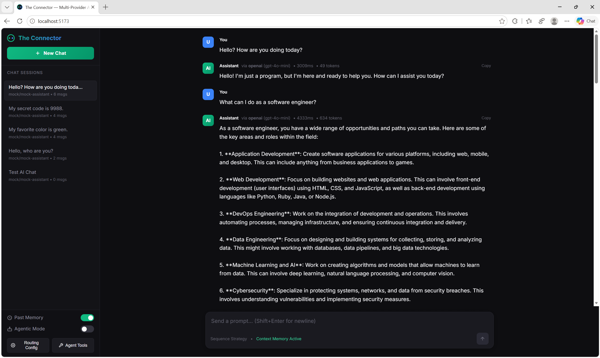
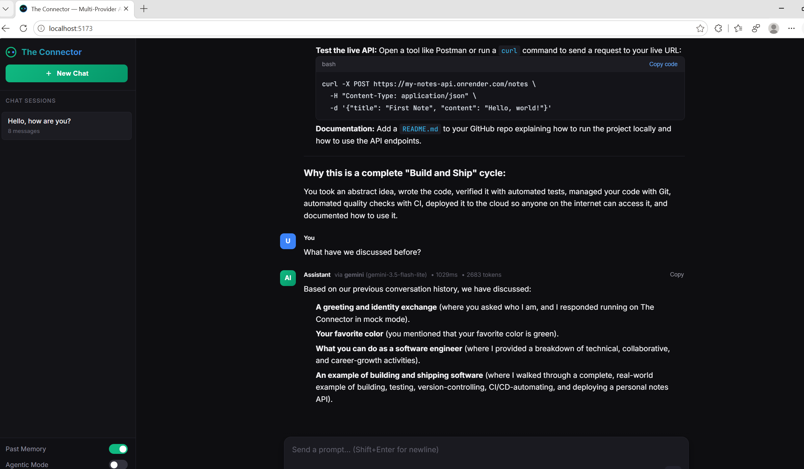
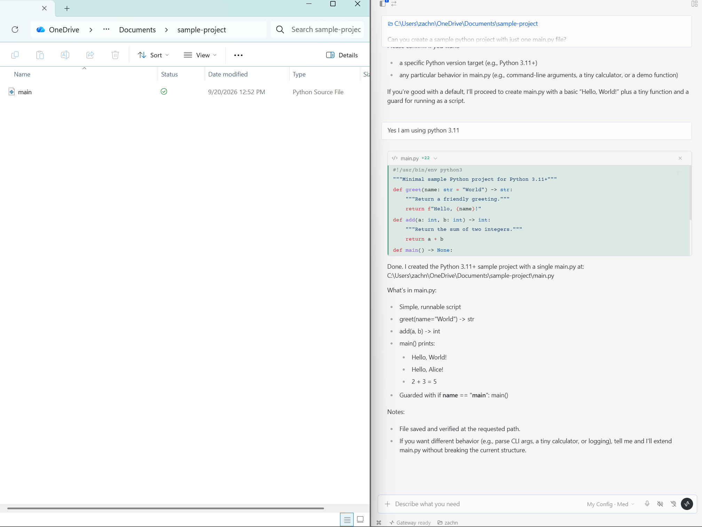

# The Connector

A React and FastAPI chat application connecting OpenAI, Claude, Gemini, OpenRouter, Ollama, and a local mock provider. Save named routing configurations and expose active entries as OpenAI-compatible models for Hermes or other agent clients. Web chat sessions retain their own `config.json` snapshots, including routing, effort, system prompt, and memory settings.

## Run the backend only

For Hermes or API clients, Python and the backend dependencies are sufficient; Node and the frontend are not required. Run these commands from the repository directory.

Windows Command Prompt:

```cmd
py -m venv .venv
.venv\Scripts\python.exe -m pip install -r backend\requirements.txt
if not exist .env copy .env.example .env
run_backend.bat
```

Linux, macOS, or WSL:

```bash
python3 -m venv .venv
.venv/bin/python -m pip install -r backend/requirements.txt
test -f .env || cp .env.example .env
bash run_backend.sh
```

The default address is **http://127.0.0.1:8301**, with interactive documentation at **http://127.0.0.1:8301/docs** and the OpenAI base URL **http://127.0.0.1:8301/v1**. The batch and shell wrappers prefer the repository's virtual environment. Stop the server with Ctrl+C.

Add credentials for the upstream providers you intend to use to `.env`, then restart the backend:

```env
OPENAI_API_KEY=your-key-here
ANTHROPIC_API_KEY=your-key-here
GEMINI_API_KEY=your-key-here
OPENROUTER_API_KEY=your-key-here
OLLAMA_HOST=http://localhost:11434
```

The launcher loads the repository `.env` without replacing existing environment variables. The local gateway does not authenticate inbound API requests; SDK clients can use `local-placeholder` as their required API key. Actual upstream keys are read by the backend. Keep the default loopback binding for local use.

The backend-only launchers accept `--host`, `--port`, and `--reload`:

```cmd
run_backend.bat --port 8302 --reload
```

```bash
bash run_backend.sh --port 8302 --reload
# Equivalent with an activated Python environment:
python run_backend.py --host 127.0.0.1 --port 8302 --reload
```

`--reload` is for backend development. Changing the port also requires updating client base URLs.

### Database location

Sessions, conversation memory, saved configurations, and configuration history share a SQLite database in the system temp directory. On Windows the default is **`%TEMP%\the_connector\connector.db`**; on other systems it is `tempfile.gettempdir()/the_connector/connector.db`. The folder and filename stay the same across restarts; this is separate from the disposable per-session export folders.

On the first start with this default location, an existing `backend/data/connector.db` is copied with SQLite's backup API, including committed changes in its write-ahead log. The old file is retained as a backup. An existing database at the new location is never overwritten or merged automatically. New installations do not create a database under the project.

System temp cleanup can remove this database. Keep a backup if you need long-term retention. To choose another location, set `DB_PATH` in `.env`, for example `DB_PATH=C:/Users/your-name/Connector/connector.db`, and restart. An explicit `DB_PATH` takes precedence; `DATA_DIR` can alternatively set the containing directory. Automatic migration from the old project path applies only to the default temp database.

### Request, response, and routing diagnostics

Request/response logging and internal database auditing are enabled by default. After restarting the backend, calls to the following endpoints write UTF-8 JSON Lines files under **`%TEMP%\the_connector\logs`** (or `tempfile.gettempdir()/the_connector/logs` on other systems). Files appear when the corresponding endpoint is called. Existing requests and responses from before logging was enabled are not reconstructed. Existing filenames are retained for compatibility.

| Endpoint | Log filename |
| --- | --- |
| `GET /api/config-history` | `get_api_config-history.jsonl` |
| `GET /api/configs` | `get_api_configs.jsonl` |
| `GET /api/models` | `get_api_models.jsonl` |
| `GET /api/providers/models` | `get_api_providers_models.jsonl` |
| `GET /api/sessions` | `get_api_sessions.jsonl` |
| `GET /api/sessions/{session_id}` | `get_api_sessions_session_id.jsonl` |
| `GET /api/v1/models` | `get_api_v1_models.jsonl` |
| `GET /api/v1/models/{model_id}` | `get_api_v1_models_model_id.jsonl` |
| `POST /api/api/show` | `post_api_api_show.jsonl` |
| `POST /api/chat` | `post_api_chat.jsonl` |
| `POST /api/chat/completions` | `post_api_chat_completions.jsonl` |
| `POST /api/config-history` | `post_api_config-history.jsonl` |
| `POST /api/config/validate` | `post_api_config_validate.jsonl` |
| `POST /api/configs` | `post_api_configs.jsonl` |
| `POST /api/models/capabilities` | `post_api_models_capabilities.jsonl` |
| `POST /api/sessions` | `post_api_sessions.jsonl` |

All session IDs share the session-detail file, and all model IDs share the model-detail file. Each line includes a UTC completion timestamp, generated request ID, method, actual path, route template, HTTP status, content type, duration, response byte counts, and `body`. JSON responses are stored as JSON values; SSE responses retain their complete `data:` text, including tool calls and `[DONE]`. Successful responses, validation errors, missing records, and generated 500 responses are logged. Interrupted responses have `complete: false`; failures also include `error_type` when available.

Each record also includes `request.body`, its content type, byte counts, capture/completion flags, and parsed query parameters. JSON requests are stored as JSON values; malformed JSON remains text. Duplicate query parameters are preserved. Authorization/cookie headers are excluded, and credential-like query parameters such as `api_key`, `token`, and `password` are redacted. Request and response bodies are otherwise captured in full by default, including any configuration or conversation data they contain. Request chunks are captured as the application reads them; an unread or interrupted upload is marked incomplete rather than consumed by the logger. Streaming chunks pass through unchanged.

`routing.requested_model` identifies the requested library model alias when supplied. `routing.configuration_id` and `routing.session_id` correlate the library entry or session. `routing.selected` records the successful provider, configured model, selected model, and effort. Structured completions use the upstream-reported model name when available; the text-chat connectors expose the selected configured model. `routing.attempts` records retries, fallback candidates, successes, unsupported routes, elapsed time, and error types. Discovery, configuration management, validation, and session creation do not invoke a model: these records have `routing.performed: false`, no selected model, and no attempts. Routing facts are internal and do not change completion response payloads.

The same record is appended to **`internal_api_audit`** in the existing memory SQLite database (`%TEMP%\the_connector\connector.db` by default, respecting `DB_PATH`). `request_id` correlates the file and database copies. This table is separate from sessions, messages, configuration history, and model memory. It has no UI, public read endpoint, or export feature, and it is never included in prompts or conversation-memory retrieval. Database records persist across restarts and are not deleted when log files rotate or sessions close. No automatic database retention limit is applied.

This is application-level separation, not filesystem access control: the server account and tools with that account's filesystem permissions (including the existing Python execution tool) can read the database. The local application does not isolate records from machine administrators or arbitrary code running as the server.

Each endpoint file rotates before an append would take it above 10 MiB, retaining five numbered backups (`.jsonl.1` through `.jsonl.5`, newest first). One complete response can exceed that target size and is kept together on one line. File locking protects appends and rotation across concurrent requests and backend processes. Logs remain separate from the database even when `DB_PATH` or `DATA_DIR` is customized.

Optional `.env` settings (restart after changing them):

```env
RESPONSE_LOGGING_ENABLED=true
# RESPONSE_LOG_DIR=C:/path/to/logs
RESPONSE_LOG_MAX_BYTES=10485760
RESPONSE_LOG_BACKUP_COUNT=5
# 0 means complete bodies; a positive value caps captured bytes per response.
RESPONSE_LOG_MAX_BODY_BYTES=0
REQUEST_LOG_MAX_BODY_BYTES=0
INTERNAL_AUDIT_ENABLED=true
```

With a body limit, oversized requests or responses are stored as text prefixes with `truncated: true` in both destinations; the HTTP payload remains intact. The file and database switches are independent: `RESPONSE_LOGGING_ENABLED=false` disables file output, while `INTERNAL_AUDIT_ENABLED=false` disables database auditing. Failures in one destination do not suppress the other or change the HTTP response. To watch chat completion request/response records in PowerShell after the first request:

```powershell
Get-Content -LiteralPath "$env:TEMP\the_connector\logs\post_api_chat_completions.jsonl" -Tail 10 -Wait
```

## Run the full application

For the web UI, run `setup.bat` then `run.bat` on Windows. On Linux/macOS, run `chmod +x setup.sh run.sh`, then `./setup.sh` and `./run.sh`. Setup installs Python and Node dependencies. The full application uses frontend **http://localhost:5173** and backend **http://127.0.0.1:8301**. Vite proxies `/api` to port 8301; update `frontend/vite.config.js` if you change the backend port. On Windows the full-stack launcher opens a backend console; close that console or press Ctrl+C in it when finished.

## Start a conversation

The landing page contains no sample chats or suggested prompts, and opening the application does not create a session. Choose a saved configuration from the **Configuration library**, or upload a file, paste JSON, or explicitly use the example. **Download example** provides a starter file; **Download config.json** saves your edited configuration. Sending the first message creates a session with the selected configuration.

The downloadable example uses provider `openai`, model `gpt-5-nano`, with `minimal` effort and requires an OpenAI key. For testing without API keys, use:

```json
{
  "sequences": [{"provider": "mock", "model": "mock-assistant", "retries": 0}]
}
```

The configuration editor exposes an effort selector for each supported route, including every choice inside a probability group. Changes update the JSON. Saving an existing session's configuration or changing its Past Memory toggle persists the change for subsequent requests. Other sessions retain their own settings.

Messages render Markdown headings, emphasis, lists, tables, quotes, task lists, and code. Code blocks preserve whitespace and include copy controls. Raw HTML is disabled and unsafe link schemes are filtered. Sessions can be exported as ZIP files containing Markdown and JSON transcripts plus metadata.

[](images/chat_support.png)

*Chatting through The Connector. This capture shows an earlier version of the interface.*

## Configuration library

A saved configuration has a display `name`, a unique stable `model_id`, a routing `config`, an `active` flag (default `true`), and optional `description` and `context_length` metadata. The database-generated `id` identifies its management record; the chosen `model_id` identifies it in completion requests. Model IDs must start with a letter or digit, contain only letters, digits, `.`, `_`, or `-`, and be at most 100 characters. A saved `model_id` cannot be renamed.

The library starts empty. Only active entries appear in `/v1/models`. Editing an entry affects future compatibility requests and sessions subsequently created from it. Deactivating or deleting it removes it from discovery and blocks new inference through that model ID. Deactivation also blocks new sessions using its `config_id`. Existing web sessions retain independent snapshots and continue to work.

`context_length` describes the actual token capacity available across **every** route, including fallback choices. Set it to the smallest usable capacity, accounting for a local server's configured context limit. It is metadata, not a command that increases upstream context capacity. When absent, the gateway uses a conservative known minimum across routes; it omits the value if any route is unknown. The mock model advertises 32,000 tokens and is intended for API testing, not a capable Hermes model.

| Method and endpoint | Body / result |
| --- | --- |
| `GET /api/configs` | List all entries; `?active_only=true` filters active entries |
| `POST /api/configs` | `{ "name": "...", "model_id": "...", "config": { ... } }`; optional `active`, `description`, `context_length`; returns the saved record with HTTP 201 |
| `GET /api/configs/{id}` | Retrieve the saved record and normalized config |
| `PATCH /api/configs/{id}` | Update `name`, `description`, `active`, `context_length`, or replace the whole `config`; omitted fields are preserved |
| `DELETE /api/configs/{id}` | Delete the library record; HTTP 204; session snapshots remain |
| `GET /api/configs/{id}/download` | Download the routing object as `config.json`, without library metadata |

Set `context_length` to `null` to remove an explicit declaration. Other editable fields cannot be `null`. Duplicate model IDs return HTTP 409; invalid records return 422; missing IDs return 404.

### Loaded configuration history

Open the **Configuration library** and choose **Load history** to inspect previously loaded configurations. Each entry includes its name, source, first and most recent load times, and the saved JSON. You can download it, use that exact configuration in a new chat, or save it as a named library entry.

History retains validated uploads, configurations applied in the editor, session configurations, and library configuration versions. Identical normalized configurations share one history entry with an updated load count and timestamp. A changed configuration creates a separate snapshot. Closing a session or changing, deactivating, or deleting a library entry does not erase its historical snapshots. History entries are not automatically exposed as active models; save one to the library and activate it to use it through Hermes.

Existing library records and available configuration snapshots from active and closed sessions are imported into history when the upgraded backend opens the database. Versions overwritten before this feature existed cannot be reconstructed. Merely validating JSON through `/api/config/validate` does not add it to history.

| Method and endpoint | Body / result |
| --- | --- |
| `GET /api/config-history` | List historical snapshots, most recently loaded first |
| `POST /api/config-history` | `{ "config": { ... }, "name": "my-config.json", "source": "upload" }`; record a validated load and return the normalized snapshot |
| `GET /api/config-history/{id}` | Inspect one snapshot and its load metadata |
| `GET /api/config-history/{id}/download` | Download that snapshot as `config.json` |

`name` and `source` are optional on POST. Sources are `upload`, `editor`, `session`, `library`, and `history`; the default is `editor`. Reuse a snapshot through `POST /api/sessions` with `{ "title": "Using an earlier config", "history_id": "the-history-entry-id" }`. This uses the historical JSON even if the originating library entry has since changed or been deleted.

### Save a configuration with curl

Save this envelope as `saved-config.json` for an API-only mock demo:

```json
{
  "name": "Connector demo",
  "model_id": "connector-demo",
  "description": "Local mock API and tool-loop test",
  "active": true,
  "config": {
    "sequences": [{"provider": "mock", "model": "mock-assistant", "retries": 0}]
  }
}
```

Run the following in any terminal. On Windows use `curl.exe` if PowerShell aliases `curl` to another command. File bodies avoid shell-specific JSON quoting:

```bash
curl --fail-with-body -sS -H "Content-Type: application/json" --data-binary @saved-config.json http://127.0.0.1:8301/api/configs
curl --fail-with-body -sS http://127.0.0.1:8301/v1/models
curl --fail-with-body -sS http://127.0.0.1:8301/v1/models/connector-demo
```

The creation response includes the record's `id`. Repeating creation with the same `model_id` returns 409; use that record's PATCH endpoint to update it.

### Import your existing config.json with Python

Save this as `import_config.py` and run it with the project's Python environment. It imports the JSON **contents**; the server never reads a client-supplied filesystem path. `httpx` is included in backend requirements.

```python
import json
from pathlib import Path
import httpx

config = json.loads(Path("config.json").read_text(encoding="utf-8-sig"))
with httpx.Client(base_url="http://127.0.0.1:8301", timeout=30) as client:
    checked = client.post("/api/config/validate", json=config)
    checked.raise_for_status()
    created = client.post("/api/configs", json={
        "name": "My assistant",
        "model_id": "my-assistant",
        "active": True,
        "config": checked.json(),
        # Add context_length only when you know every route's actual capacity.
    })
    created.raise_for_status()
    record = created.json()
    print("Configuration ID:", record["id"])
    print("Model ID:", record["model_id"])
    print(client.get("/v1/models").json())
```

To obtain a starting file, run `curl --fail-with-body -sS -o config.json http://127.0.0.1:8301/api/config/example`, then edit it. This downloads the explicit example; it does not save or activate a model automatically.

## Session configuration

Sessions use only their saved configuration. The backend does not load the repository's root `config.json` when creating or running a session. Provider credentials remain in the server environment; they are not configuration fields.

Routing steps run in order. A probability group selects its first candidate by relative weight, then tries the other configured choices if needed. Each route can retry before moving on. A failure across all configured routes returns an error; a mock response is available only when a mock route is explicitly configured.

Each probability selection also emits an INFO message in the backend console, for example `INFO:     127.0.0.1:54321 --- probabilistic chooser chose model gpt-5-nano (provider=openai)`. This logs the initial random choice once per probability group reached, before retries or fallbacks, for both session/agent chat and compatibility completions. It is independent of file logging and database auditing; calls outside an HTTP request show `unknown` as the client address.

```json
{
  "system_prompt": "You are a helpful assistant. Use supplied conversation context.",
  "past_memory": true,
  "context_window": 10,
  "memory_window": 20,
  "memory_scope": "all_sessions",
  "sequences": [
    {
      "type": "probability",
      "retries": 1,
      "choices": [
        {
          "provider": "openai",
          "model": "gpt-5-nano",
          "effort": "medium",
          "probability": 60
        },
        {
          "provider": "gemini",
          "model": "gemini-2.5-flash",
          "effort": "low",
          "probability": 40
        }
      ]
    },
    {
      "provider": "claude",
      "model": "claude-sonnet-4-6",
      "effort": "high",
      "retries": 0
    }
  ]
}
```

Only `sequences` is required at the top level. It must contain 1-30 steps; probability groups must contain 1-30 choices with at least one positive weight. Every route requires a provider and model. `retries` accepts 0-5 additional attempts and defaults to 1; choices inherit their group's retry count unless they set their own. Unknown fields and unsupported effort values return validation errors.

| Setting | Default | Meaning |
| --- | --- | --- |
| `system_prompt` | Helpful assistant instruction | System instruction for this session |
| `past_memory` | `true` | Include saved conversation context |
| `context_window` | `10` | Recent messages from the current session; range 1-200 |
| `memory_window` | `20` | Maximum archived messages included; range 0-200; `0` disables the archive |
| `memory_scope` | `"all_sessions"` | Include other saved conversations, or use `"session"` for current-session history only |

### Model effort

Omitting `effort` selects the lowest supported level. There is no universal `easy` value. The capability registry in [model_capabilities.py](backend/app/model_capabilities.py) defines the levels the application currently supports; models without a registered effort control remain usable with the field omitted. Unsupported settings are rejected before a provider call.

The following examples show the provider mappings. Query `/api/models/capabilities` for a particular model or version.

| Provider / example models | Levels in increasing order | Provider request mapping |
| --- | --- | --- |
| OpenAI `gpt-5`, `gpt-5-mini`, `gpt-5-nano` | `minimal`, `low`, `medium`, `high` | Chat Completions `reasoning_effort`; Responses fallback `reasoning.effort`. [OpenAI documentation](https://developers.openai.com/api/docs/models/gpt-5) |
| OpenAI `o1`, `o3`, `o3-mini`, `o4-mini` | `low`, `medium`, `high` | Same OpenAI request fields |
| Claude Opus 4.5 and Sonnet 4.6 | `low`, `medium`, `high` | `output_config.effort`. [Claude documentation](https://platform.claude.com/docs/en/build-with-claude/effort) |
| Claude Opus 4.6 | `low`, `medium`, `high`, `max` | `output_config.effort` |
| Gemini 2.5 Flash / Flash-Lite | `none`, `low`, `medium`, `high` | SDK `thinking_config.thinking_budget`; REST `thinkingConfig.thinkingBudget`. [Gemini documentation](https://ai.google.dev/gemini-api/docs/thinking) |
| Gemini 2.5 Pro | `low`, `medium`, `high` | Same Gemini budget fields |
| OpenRouter | Levels of the registered underlying model | `reasoning.effort`, carried through `extra_body` in the OpenAI SDK. [OpenRouter documentation](https://openrouter.ai/docs/guides/best-practices/reasoning-tokens) |
| Ollama `gpt-oss` (including model tags) | `low`, `medium`, `high` | Top-level `think`. [Ollama documentation](https://docs.ollama.com/capabilities/thinking) |

For Gemini 2.5, this application's named levels map to token budgets: `none` = 0, `low` = 1,024, `medium` = 8,192, and `high` = 24,576. These are application presets for the provider's budget control. Flash models default to `none`; Pro defaults to `low`.

The OpenAI Responses fallback above belongs to the web-chat connector. The external compatibility interface serves Chat Completions and does not implement a Responses endpoint.

## Saved memory

Past Memory retrieves persisted SQLite messages and successful OpenAI-compatible completion responses and supplies them to the configured model for chat, agent, and compatible completion requests. It survives application restarts. The recent context contains up to `context_window` messages from the current web session, counted as individual messages rather than user/assistant pairs.

The archive puts today's raw memory first (up to `memory_window` items), followed by daily summaries for the preceding seven completed UTC days. On the first memory-enabled request after a day ends, that day's eligible rows from `messages` and `completions_response` are compacted through the configured LLM into fewer than 200 words and saved in `memory_summary`; a bounded extractive fallback keeps memory available if that call fails. Older summaries are removed. Raw session transcripts and compatible response records remain stored. Each item is capped at 4,000 characters, today's section at 8,000 encoded characters, and the complete encoded archive at 16,000 characters. Recent web-session context is excluded from today's archive to avoid duplicates. Archived text is marked as untrusted historical data, and bounded retrieval can omit older facts.

Setting `past_memory: false` disables retrieval for that session or compatible configuration and excludes that web session as a source for other conversations. Its transcript is still saved. Setting `memory_scope: "session"` restricts a web session to its own history; for a sessionless compatible call, it restricts memory to compatible responses. The default `all_sessions` scope combines eligible session messages and compatible responses.

Memory is scoped to this application's local database, which is intended for a single user. There is no per-account separation. **Close session** archives the conversation and clears temporary files; it does not erase its stored messages. Closed sessions can still contribute memory when enabled and remain accessible by session ID for viewing or export.

[](images/memory_support.png)

*Recalling earlier conversation topics with Past Memory enabled.*

## Web session and application API

Requests use JSON. For creation, pass the parsed contents of the chosen file as `config`; do not send a server file path or multipart upload.

```http
POST /api/sessions
Content-Type: application/json

{
  "title": "My conversation",
  "config": {
    "sequences": [{"provider": "mock", "model": "mock-assistant", "retries": 0}],
    "past_memory": true
  }
}
```

Alternatively, create from an active library entry with `{ "title": "My conversation", "config_id": "the-library-record-id" }`, or from history with `{ "title": "My conversation", "history_id": "the-history-entry-id" }`. Provide **exactly one** of `config`, `config_id`, or `history_id`. `config_id` is the saved record's ID, not its `model_id`. Creation copies the selected configuration into the session.

Creation returns HTTP 201 with `session_id` and session metadata. `title` is optional. `POST /api/new` is a deprecated alias with the same contract. Legacy top-level `provider`, `model`, or memory overrides are rejected.

| Method and endpoint | Request / result |
| --- | --- |
| `GET /api/sessions` | List active sessions |
| `GET /api/sessions/{id}` | Return `session`, `messages`, normalized `config`, and `system_prompt` |
| `PATCH /api/sessions/{id}` | Replace the active session's configuration with `{ "config": { ... } }`; return updated session detail |
| `DELETE /api/sessions/{id}` | Close and archive the session |
| `DELETE /api/close` | Closing alias; pass `?session_id=...` or `{ "session_id": "..." }` |
| `GET /api/sessions/{id}/export-zip` | Download the transcript ZIP, including for closed sessions |
| `GET /api/config/example` | Download a standalone example named `config.json` |
| `POST /api/config/validate` | Submit the raw config object, without a `config` wrapper; receive normalized configuration without creating a session |
| `GET /api/providers/models` | Underlying provider catalog with `effort_levels` and `default_effort`; previously `/api/models` |
| `POST /api/models/capabilities` | Submit `{ "provider": "openai", "model": "gpt-5-nano" }` to inspect effort support |
| `GET /api/health` | Service status, version, and provider key readiness |

There is no global `GET` or `POST /api/config` endpoint. Edit the selected session with `PATCH /api/sessions/{id}`. Closing a session prevents further chat and configuration changes. Older direct-provider sessions migrate their saved settings to a configuration snapshot. A legacy routing session without a saved snapshot must be given a configuration before it can continue.

### Chat and agents

`POST /api/chat` accepts only:

```json
{"session_id": "your-session-id", "message": "What do you remember from our saved conversations?"}
```

The reply includes the assistant content, selected provider/model, token usage, latency, and routing attempt details including effort. Provider usage counters are used when available; otherwise counts are estimated.

`POST /api/agent/run` uses the same session configuration and memory:

```json
{"session_id": "your-session-id", "prompt": "Calculate 45 * 180 + 950.", "max_steps": 5}
```

`max_steps` accepts 1-15 and defaults to 5; an optional `tools` list selects the tools described to the agent. The response includes tool steps and a final answer, which is saved in the session. Neither chat nor agent requests accept provider/model overrides.

`GET /api/agent/tools` lists available tool schemas. `POST /api/agent/step` executes `{ "tool": "calculator", "arguments": { "expression": "25 * 4" } }`. `POST /api/agent/register-tool` registers a named tool schema and optional external webhook endpoint.

The application endpoints use FastAPI errors such as `{ "detail": "..." }`: 422 for invalid request bodies, 404 for missing records, 409 for closed sessions or inactive configurations, and 502 when configured providers fail.

## OpenAI-compatible API for external agents

Use **`http://127.0.0.1:8301/v1`** as the client base URL. The request's `model` must be an active library `model_id`, such as `connector-demo` or `my-assistant`; a raw upstream name is not automatically exposed. `GET /v1/models` returns the OpenAI `{ "object": "list", "data": [...] }` shape with active entries and available context metadata.

Completion requests remain **sessionless**: send the active conversation and tool results in `messages` each time. They do not create web sessions, but when the selected configuration has `past_memory: true`, its system prompt receives the bounded daily memory archive described above. Every successful buffered response (including a response later emitted as SSE) is saved by itself in `completions_response`; request payloads are not copied into that table. Hermes or another calling client executes its own tools; the gateway forwards tool definitions, returns structured `tool_calls`, and accepts results on a subsequent request. `/api/agent/run` is the separate session-based agent that executes this application's local tools.

### Text request with curl

After saving the mock library entry above, save this as `completion.json`:

```json
{
  "model": "connector-demo",
  "messages": [{"role": "user", "content": "Hello from an API client."}],
  "max_tokens": 128
}
```

```bash
curl --fail-with-body -sS -H "Content-Type: application/json" --data-binary @completion.json http://127.0.0.1:8301/v1/chat/completions
```

The response contains `choices[0].message`, `finish_reason`, and OpenAI-style `usage` (`prompt_tokens`, `completion_tokens`, `total_tokens`). Its `model` remains the requested library model ID, even when the config selects an upstream fallback.

### Python SDK: text, a tool round trip, and streaming

Save this as `client_demo.py` and run it in the project's Python environment. It uses the mock entry created above and performs no paid upstream calls. Change `MODEL` to an active real configuration for real inference.

```python
import json
from openai import OpenAI

client = OpenAI(base_url="http://127.0.0.1:8301/v1", api_key="local-placeholder")
MODEL = "connector-demo"
print([model.id for model in client.models.list().data])

reply = client.chat.completions.create(
    model=MODEL,
    messages=[{"role": "user", "content": "Hello!"}],
)
print(reply.choices[0].message.content)

tools = [{
    "type": "function",
    "function": {
        "name": "add",
        "description": "Add two integers.",
        "parameters": {
            "type": "object",
            "properties": {"a": {"type": "integer"}, "b": {"type": "integer"}},
            "required": ["a", "b"],
        },
    },
}]
messages = [{"role": "user", "content": "Use add to add 2 and 3."}]
turn = client.chat.completions.create(
    model=MODEL, messages=messages, tools=tools, tool_choice="required",
)
assistant = turn.choices[0].message
# Preserve the complete assistant message, including provider replay metadata.
messages.append(assistant.model_dump(exclude_none=True))
for call in assistant.tool_calls or []:
    if call.function.name != "add":
        raise ValueError("Unexpected tool")
    args = json.loads(call.function.arguments)
    if type(args.get("a")) is not int or type(args.get("b")) is not int:
        raise ValueError("Expected integer tool arguments")
    # The caller executes this explicit local function, not the gateway.
    messages.append({
        "role": "tool", "tool_call_id": call.id,
        "content": json.dumps({"result": args["a"] + args["b"]}),
    })
final = client.chat.completions.create(
    model=MODEL, messages=messages, tools=tools, tool_choice="none",
)
print(final.choices[0].message.content)
# The mock generates deterministic schema examples, not arithmetic reasoning.

stream = client.chat.completions.create(
    model=MODEL, messages=[{"role": "user", "content": "Describe your role."}],
    stream=True, stream_options={"include_usage": True},
)
for chunk in stream:
    if chunk.choices:
        print(chunk.choices[0].delta.content or "", end="", flush=True)
    if chunk.usage:
        print("\nUsage:", chunk.usage.model_dump())
print()
```

Tool results must reference an earlier assistant call's `id` using `tool_call_id`. Keep the full returned assistant message when replaying it: native Claude and Gemini routes can include metadata needed for the next turn.

For curl streaming, save this as `stream.json`:

```json
{
  "model": "connector-demo",
  "messages": [{"role": "user", "content": "Hello through SSE."}],
  "stream": true,
  "stream_options": {"include_usage": true}
}
```

```bash
curl --fail-with-body -sS -N -H "Content-Type: application/json" --data-binary @stream.json http://127.0.0.1:8301/v1/chat/completions
```

Streaming is **buffered SSE**: the backend waits for the complete upstream response, then emits role/content/tool-call deltas, a finish event, optional usage, and `data: [DONE]`. It provides the streaming protocol expected by SDKs, not live upstream token delivery or reduced first-token latency.

### Supported requests and limits

| Feature | Current behavior |
| --- | --- |
| Messages | `system`, `developer`, `user`, `assistant`, and `tool` roles; structured function calls and linked tool results |
| Function tools | `tools`, `tool_choice` (`auto`, `none`, `required`, or named function), and provider-dependent `parallel_tool_calls` |
| Generation options | `temperature`, `top_p`, one of `max_tokens` / `max_completion_tokens`, `stop`, `seed`, `response_format`, and frequency/presence penalties, subject to the selected transport |
| Effort | The saved route owns effort. A client's `reasoning_effort` is accepted for compatibility but cannot override the config |
| OpenAI / OpenRouter | Structured Chat Completions forwarded through the OpenAI SDK; upstream model capabilities still apply |
| Native Claude | Text/function tools; `seed`, frequency/presence penalties, and `response_format` are rejected |
| Native Gemini | Text/function tools and JSON response formats; frequency/presence penalties and strict OpenAI tool schemas are rejected; cannot guarantee `parallel_tool_calls=false` |
| Native Ollama | Text/function tools and JSON response formats; forced/named tool choice, strict tool schemas, and guaranteed serial tool calls are unsupported |
| Mock | Deterministic text, tool-call/result, and JSON-format fixtures for testing; no real model reasoning |
| Streaming | Buffered SSE only; `stream_options` supports `include_usage` |
| Multiple outputs / storage | Only `n=1` and `store=false`; `user` and `metadata` are accepted but not persisted or sent upstream |
| Other API families | No `/v1/responses`, embeddings, image/audio generation, or Ollama `/api/chat` inference endpoint; use Chat Completions |

Native Claude, Gemini, and Ollama conversions support text content and function tools; arbitrary image/audio content is not a portable capability across routes. Unknown top-level request options are rejected. If a route cannot represent a requested option, routing can try another configured route. When every candidate is unsupported, the gateway returns an error rather than silently dropping tools. For OpenAI reasoning routes, omit `temperature` or use `1` when effort is enabled.

### Discovery aliases and probes

Use `/v1` for a new client integration. Aliases allow clients with an existing root or `/api` base URL to discover and call the same active configuration models.

| Purpose | Endpoints |
| --- | --- |
| OpenAI model list | `GET /v1/models`, `/api/v1/models`, `/api/models`, `/models` |
| One active model | Same model-list paths followed by `/{model_id}` |
| OpenAI completions | `POST /v1/chat/completions`, `/api/v1/chat/completions`, `/api/chat/completions`, `/chat/completions` |
| Ollama-style discovery only | `GET /api/tags`, `/api/api/tags`; `POST /api/show`, `/api/api/show` with `{ "model": "connector-demo" }` (`name` is an alias) |
| llama.cpp-style properties | `GET /props`, `/v1/props`, `/api/props`, `/api/v1/props`; optional `?model=connector-demo` |
| Version | `GET /version`, `/api/version` |
| Service root | `GET /` returns service/version/status, API links, and active-configuration count |
| Icon | `GET /favicon.ico`, `/favicon.svg` returns the SVG icon |
| API reference | `GET /docs`, `/redoc`, `/openapi.json` |

`/api/models` now returns active saved configurations in OpenAI format. Clients needing the underlying provider catalog must use `/api/providers/models`. The tags/show/properties routes describe routing configurations; they do not load local model weights.

### Completion errors

Compatibility errors use the OpenAI error envelope:

```json
{
  "error": {
    "message": "Active configuration model 'missing-model' not found. Save and activate a configuration in /api/configs, then use its model_id.",
    "type": "invalid_request_error",
    "param": "model",
    "code": "model_not_found"
  }
}
```

| HTTP status / code | Meaning and action |
| --- | --- |
| 400 / `invalid_request_error` | Invalid messages, unknown fields, or malformed request; inspect `error.message` |
| 400 / `unsupported_option` | No configured transport can represent the options; adjust the request or routes |
| 404 / `model_not_found` | Wrong model ID, or its saved configuration is inactive/deleted; inspect `/v1/models` |
| 502 / `upstream_error` | All configured upstream routes failed; inspect credentials, provider availability, and error text |
| 502 / `empty_completion` | Missing content and tool calls without a refusal/filter result; legitimate empty-string, refusal, and content-filter responses are preserved |

## Hermes Agent setup

First save and activate a real configuration with model ID `my-assistant` using the library or Python import above. Confirm it appears at `http://127.0.0.1:8301/v1/models`. This gateway connection uses Hermes's custom OpenAI Chat Completions transport; Hermes owns its conversation and tool execution.

Add this named provider to `~/.hermes/config.yaml`:

```yaml
providers:
  connector:
    api: http://127.0.0.1:8301/v1
    api_key: local-placeholder
    transport: chat_completions
    discover_models: true

model:
  provider: custom:connector
  default: my-assistant
```

Named provider configuration and the `custom:<name>` selector follow [Hermes's provider documentation](https://hermes-agent.nousresearch.com/docs/integrations/providers#named-custom-providers). Alternatively run `hermes model`, choose the named **connector** provider, and select an active configuration. Start a new `hermes chat`; the interactive picker persists the provider and model in `config.yaml`. See [Configuring Models](https://hermes-agent.nousresearch.com/docs/user-guide/configuring-models#hermes-model-subcommand).

For a single custom endpoint, the equivalent manual model block is:

```yaml
model:
  provider: custom
  base_url: http://127.0.0.1:8301/v1
  api_key: local-placeholder
  api_mode: chat_completions
  default: my-assistant
```

Use a real route with at least **64,000 tokens** of usable context for Hermes, as its [local-provider guide](https://hermes-agent.nousresearch.com/docs/integrations/providers) specifies. Declare the verified minimum across routes in the saved entry's `context_length`; do not enlarge metadata to hide an upstream limit. If capacity is unknown, determine it from the serving provider before setting an override. A mock entry is useful for connectivity and SDK tests only.

[](images/hermes_agent_support.png)

*Hermes Agent example: creating a Python project using the selected configuration.*

### Windows and WSL connectivity

If Hermes and the backend both run in WSL, the loopback URL works. For a Windows backend and Hermes in WSL, test `curl http://127.0.0.1:8301/v1/models` from WSL first. With NAT networking, start Windows with `run_backend.bat --host 0.0.0.0`, find its gateway address using `ip route show default` in WSL, and use `http://<windows-host-ip>:8301/v1`. Windows firewall access must permit that connection. Mirrored networking can preserve loopback access; see [Hermes's WSL networking guide](https://hermes-agent.nousresearch.com/docs/integrations/providers#wsl2-networking-windows-users).

Binding to `0.0.0.0` exposes this unauthenticated local API on available interfaces. Restrict access to the intended host/WSL connection. Use an actual hostname or IP in client URLs, never `0.0.0.0`.

If the picker is empty, confirm the backend is reachable and the library entry is active. If a chat fails with 400, inspect the unsupported-option message; provider-specific settings may not apply to every fallback route. Effort changes belong in the saved configuration. Automated compatibility tests use simulated providers and SDK clients; they do not launch Hermes or call paid upstream services.

## Tests

With the Python virtual environment active, run:

```bash
python -m pytest backend/tests -q
```

Backend tests use isolated temporary databases and fake provider clients. They cover database migration, configuration history and snapshot reuse, library CRUD and activation, OpenAI SDK parsing and tool round trips, discovery aliases, buffered SSE, native transport conversions, session snapshots, routing and effort, and memory retrieval without paid provider calls.

From `frontend`, run:

```bash
npm test
npm run build
```

Use `npm.cmd` if PowerShell's execution policy blocks `npm.ps1`. Frontend tests cover configuration controls, history uploads and rendering, and Markdown rendering, including unsafe content and whitespace preservation.
